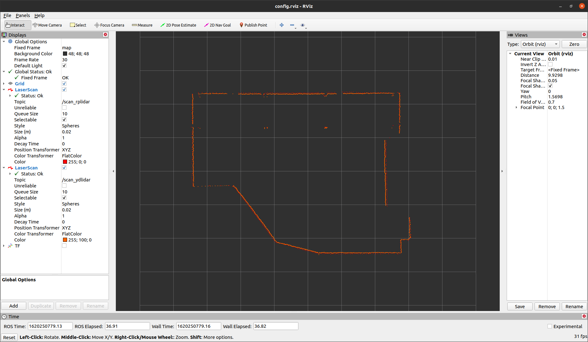
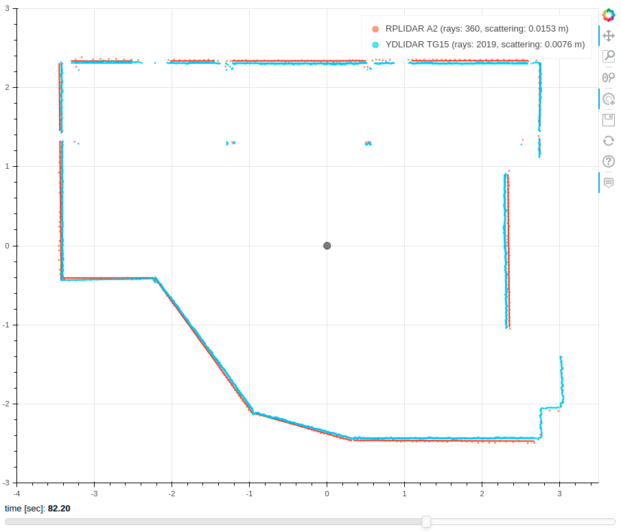
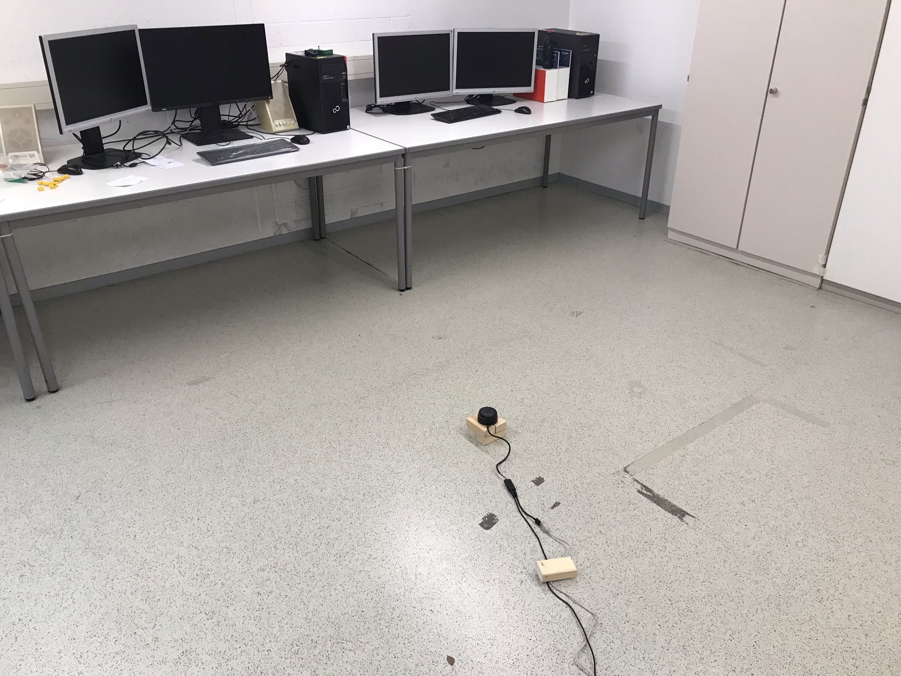

# low-cost-lidar-comparison
Comparison between the two low-cost 2D 360° lidar sensors [RPLIDAR A2](https://www.slamtec.com/en/Lidar/A2) and [YDLIDAR TG15](https://www.ydlidar.com/products/view/16.html) (ROS 1 bag files)

## Accuracy Comparison
### Resolution
* RPLIDAR: 360 rays
* YDLIDAR: 2019 rays (approx. 150 alternating rays provide no distance)

### Scattering
* RPLIDAR: 0.0152 m
* YDLIDAR: 0.0076 m

### Distance Error
* RPLIDAR: 0.0455 m
* YDLIDAR: -0.0009 m

## Visualization
### ROS Rviz

### Bokeh

## Measurement setup

## Used ROS packages
* [RPLIDAR ROS package](https://github.com/Slamtec/rplidar_ros)
* [YDLIDAR ROS package](https://github.com/YDLIDAR/ydlidar_ros)

## Development setup
* Python 3.8.5
* Bokeh 2.2.3
* Google Chrome 89.0.4389.72
* ROS Noetic
