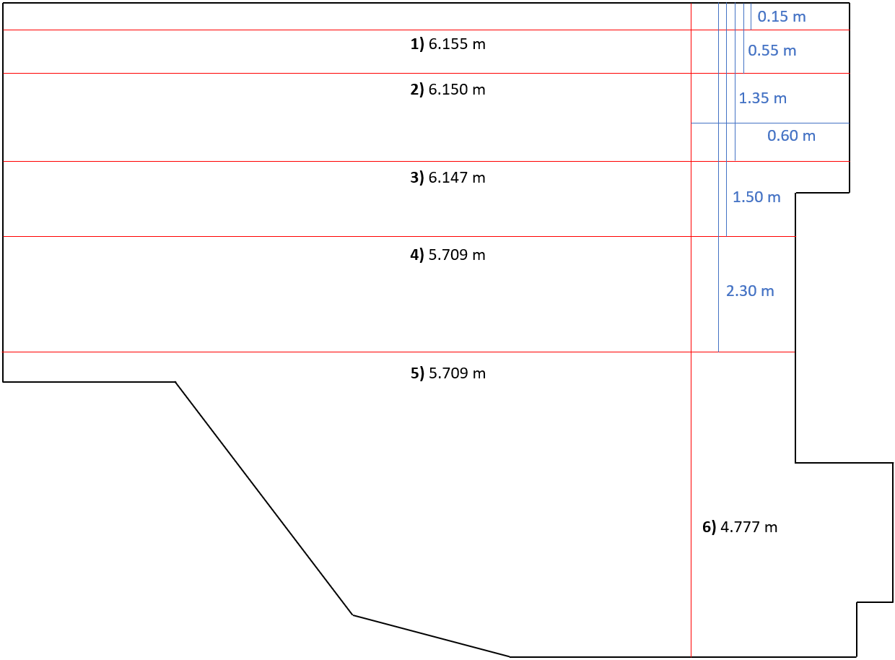

### Referenzmessungen

(Lasermessgerät - Lasermessgerät - Meterstab)
1. Messstrecke (unter den Tischen) Abstand zur Wand ca. 0,15 m ( Wand - Wand)
6,155 - 6,155 - 6,157 m

2. Messstrecke (unter den Tischen) Abstand zur Wand ca. 0,55 m (Wand - Wand)
6,150 - 6,150 - 6,155 m

3. Messstrecke (vor den Tischen) Abstand zur Wand ca. 1,30 m (Wand - Wand)
6,146 - 6,147 - 6,150 m

4. Messstrecke Abstand zur Wand ca. 1,50 m (Wand - Schrank)
5,709 - 5,709 - 5,714 m

5. Messstrecke Abstand zur Wand ca. 2,30 m (Wand - Schrank)
5,709 - 5,708 - 5,710 m

6. Messstrecke (quer) Abstand zur Wand ca. 0,60 m (Sideboard - Wand)
4,777 - 4,777 - 4,775 m

### Lidar Messungen

| Messung | Referenzmessung | RPLIDAR Messung | RPLIDAR Fehler | YDLIDAR Messung | YDLIDAR Fehler
| ------ | ------ | ------ | ------ |-----|-----|
| 1 | 6.155 m | 6.19522848 | 0.04022848 | 6.17248743 | 0.01748743 |
| 2 | 6.150 m | 6.18926752 | 0.03926752 | 6.16398169 | 0.01398169 |
| 3 | 6.147 m | 6.17809073 | 0.03109073 | 6.14803343 | 0.00103343 |
| 4 | 5.709 m | 5.77009549 | 0.06109549 | 5.70136846 | -0.00763154 |
| 5 | 5.709 m | 5.77055445 | 0.06155445 | 5.70809483 | -0.00090517 |
| 6 | 4.777 m | 4.80958941 | 0.03958941 | 4.74055739 | -0.02944261 |

| RPLIDAR Fehler Ø | YDLIDAR Fehler Ø |
| - | - |
|0.04547101412330242 m | -0.0009127930921516795 m | 